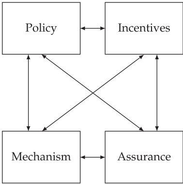

To build really dependable systems, you need four things to come together.
There’s policy: what you’re supposed to achieve. 
There’s mechanism: the ciphers, access controls, hardware tamper-resistance and other machinery that you use to implement the policy. 
There’s assurance: the amount of reliance you can place on each particular mechanism, and how well they work together.
Finally, there’s incentive: the motive that the people guarding and maintaining the system have to do their job properly, and also the motive that the attackers have to try to defeat your policy. 
All of these interact (see Figure 1.1).

As an example, let’s think of the 9/11 terrorist attacks. 
The hijackers’ success in getting knives through airport security was not a mechanism failure but a policy one; the screeners did their job of keeping out guns and explosives, but at that time, knives with blades up to three inches were permitted. 
Policy changed quickly: first to prohibit all knives, then most weapons (baseball bats are now forbidden but whiskey bottles are OK); it’s flip-flopped on many details (butane lighters forbidden then allowed again). Mechanism is weak, because of things like composite knives and explosives that don’t contain nitrogen. 
Assurance is always poor; many tons of harmless passengers’ possessions are consigned to the trash each month, while less than half of all the real weapons taken through screening (whether accidentally or for test purposes) are spotted and confiscated.

# 

這段文字介紹了建立可靠系統的四個核心要素及其相互作用，並以9/11恐怖襲擊作為案例，說明這些要素如何影響安全系統的設計和表現。

---

### **1. 四個核心要素：**

- **政策 (Policy)：你要達成的目標**  
  政策定義了系統的核心目標或要求，例如「禁止攜帶武器上飛機」。它是一個戰略層面的規範，指引其他要素的設計。

- **機制 (Mechanism)：用來實現政策的技術和工具**  
  包括加密技術、存取控制、硬件防篡改等。例如，金屬探測器和行李X光檢查是機場安檢的主要機制。

- **保證 (Assurance)：機制的可靠性**  
  保證指的是你對機制的依賴程度，及這些機制是否協調運作。例如，機場安檢機制的精確性和檢測漏洞的概率都屬於保證的範疇。

- **激勵 (Incentive)：參與者的動機**  
  - **防守方的動機：** 確保守衛系統的人有足夠的理由盡責，如經濟報酬或責任追究。  
  - **攻擊方的動機：** 理解攻擊者為什麼試圖突破系統，例如尋求經濟利益或達成政治目標。

這四個要素是相互作用的：政策決定方向，機制實現目標，保證衡量可靠性，激勵影響行為。

---

### **2. 9/11案例分析：**

- **政策的問題：**  
  當時的政策允許攜帶刀片長度小於三英寸的刀具。雖然安檢人員正確執行了政策，防止了槍支和炸藥進入飛機，但政策未能預見小型刀具的威脅。  
  - **變化：** 9/11後，政策迅速收緊，禁止攜帶所有刀具和大部分武器（如棒球棒），但政策細節經歷了多次改變（例如打火機的禁令曾被廢除又恢復）。

- **機制的弱點：**  
  雖然安檢機制能檢測金屬物品，但對於非金屬刀具（如複合材料刀具）或非含氮炸藥則無能為力，顯示機制存在漏洞。

- **保證的不足：**  
  - 很多無害物品被丟棄，表明系統存在大量的「假陽性」。  
  - 另一方面，真正的危險物品（包括測試性質的武器）只有不到一半被成功攔截，表明檢測機制的準確性不足。  

---

### **3. 總結：**

這段文字揭示了可靠系統的設計不僅僅是技術問題，還涉及戰略（政策）、技術手段（機制）、可靠性評估（保證）和人性（激勵）的多重因素。  
9/11案例說明：即使機制運作正常，錯誤的政策也會導致災難性後果。同時，保證和激勵的缺失（如安檢人員疲於應對大量無害物品）進一步降低了系統的有效性。

#

Most governments have prioritised visible measures over effective ones. 
For example, the TSA has spent billions on passenger screening, which is fairly ineffective, while the $100m spent on reinforcing cockpit doors removed most of the risk [1526]. 
The President of the Airline Pilots Security Alliance noted that most ground staff aren’t screened, and almost no care is taken to guard aircraft parked on the ground overnight. 
As most airliners don’t have door locks, there’s not much to stop a bad guy wheeling steps up to a plane and placing a bomb on board; if he had piloting skills and a bit of chutzpah, he could file a flight plan and make off with it [1204]. 
Yet screening staff and guarding planes are just not a priority.

Why are such policy choices made? Quite simply, the incentives on the decision makers favour visible controls over effective ones. 
The result is what Bruce Schneier calls ‘security theatre’ – measures designed to produce a feeling of security rather than the reality. 
Most players also have an incentive to exaggerate the threat from terrorism: politicians to ‘scare up the vote’ (as President Obama put it), journalists to sell more papers, companies to sell more equipment, government officials to build their empires, and security academics to get grants. 
The upshot is that most of the damage done by terrorists to democratic countries comes from the overreaction. 
Fortunately, electorates figure this out over time, and now – nineteen years after 9/11 – less money is wasted.
Of course, we now know that much more of our society’s resilience budget should have been spent on preparing for pandemic disease. 
It was at the top of Britain’s risk register, but terrorism was politically more sexy. 
The countries that managed their priorities more rationally got much better outcomes.

Security engineers need to understand all this; we need to be able to put risks and threats in context, make realistic assessments of what might go wrong, and give our clients good advice. 
That depends on a wide understanding of what has gone wrong over time with various systems; what sort of attacks have worked, what their consequences were, and how they were stopped (if it was worthwhile to do so). 
History also matters because it leads to complexity, and complexity causes many failures. Knowing the history of modern information security enables us to understand its complexity, and navigate it better.

So this book is full of case histories. To set the scene, I’ll give a few brief examples here of interesting security systems and what they’re designed to prevent.

# 

這段文字分析了安全政策的選擇往往偏向於**可見性**而非**實效性**，並探討了安全工程中需要考慮的歷史、風險評估和決策背景。以下是逐段的解釋：

---

### **1. 可見措施 vs. 有效措施：**

**「大多數政府優先考慮可見的措施，而非有效的措施。」**  
- 範例：  
  - 美國運輸安全管理局（TSA）花費數十億美元在乘客篩查上，但其實效性有限。  
  - 相較之下，只需花費1億美元加強駕駛艙門的安全，就能消除大部分風險。  

- 其他漏洞：  
  - 地勤人員通常未經篩查，飛機停放過夜的安保也很薄弱。  
  - 航空器缺乏門鎖，導致有人能輕易接近飛機甚至非法起飛。  

這些例子說明，決策者往往投入大量資源在「顯眼」但未必有效的措施上，而忽視了「低成本但高效益」的策略。

---

### **2. 政策選擇的驅動因素：**

**「決策者偏好可見的控制措施是因為激勵機制使然。」**  
- **「安全劇場」(security theatre)：**  
  - Bruce Schneier提出的概念，指安全措施設計的目的是營造安全的感覺，而非真正提供安全性。

- **激勵的影響：**  
  - 政治人物：渲染恐怖威脅以吸引選票（如歐巴馬所述）。  
  - 媒體：放大威脅以吸引讀者。  
  - 安全公司：賣更多設備。  
  - 官僚：擴大部門規模。  
  - 學者：爭取研究經費。  

這些利益相關者共同導致恐怖威脅被誇大，而實際上，恐怖分子對民主國家的最大破壞往往來自**過度反應**。

---

### **3. 例子：疫情準備 vs. 恐怖主義：**

**「事實證明，我們本應將更多資源投入到應對疫情，而不是恐怖主義。」**  
- **英國的例子：**  
  - 疫情被列為風險清單的首位，但恐怖主義因政治吸引力更大而獲得更多資源。  
  - 那些更理性分配資源的國家在疫情中取得了更好的結果。  

這顯示了錯誤的政策優先級如何導致重大損失，而理性分配資源能顯著改善應對能力。

---

### **4. 安全工程的啟示：**

**「安全工程師需要理解這些動態，將風險和威脅置於合理的背景下。」**  
- 核心任務：  
  - **評估：** 理性地評估可能出現的問題及其後果。  
  - **建議：** 為客戶提供基於實證的建議。  

- 歷史的重要性：  
  - **學習過去：** 知道哪些攻擊有效，後果如何，是否值得應對。  
  - **理解複雜性：** 過去的經驗導致系統日益複雜，而複雜性是失敗的主要原因之一。  
  - **案例研究：** 理解資訊安全的歷史與複雜性，能幫助安全工程師更有效地應對現代挑戰。  

---

### **5. 書的結構與目標：**

**「這本書將通過案例研究來闡述安全系統及其目標。」**  
- 書中包含大量案例，從不同情境中探討安全系統設計的成功與失敗。  
- 這些案例不僅提供實用知識，還幫助讀者理解歷史背景及其對現代安全系統的影響。

---

### **總結：**

這段文字強調了**安全政策選擇的錯誤導向**（偏重可見性而非有效性），以及**安全工程師需要具備的技能與知識**。它表明，真正有效的安全系統設計需要超越表面，基於歷史經驗、風險分析和理性資源分配來制定策略。

